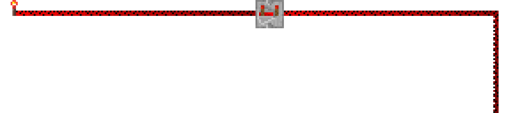
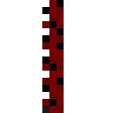
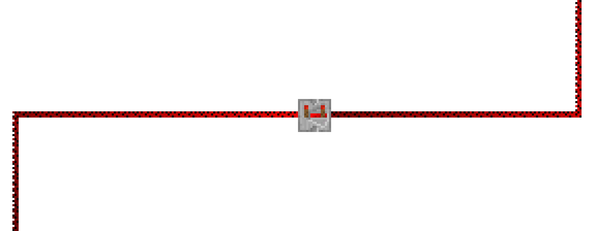
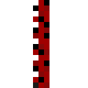
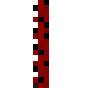
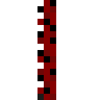
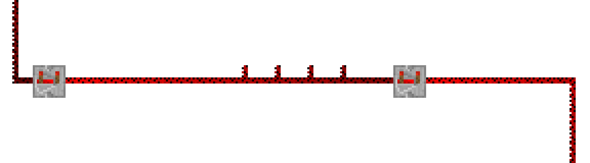
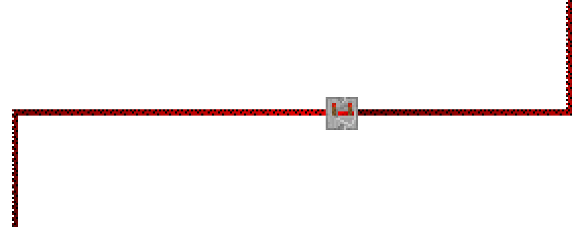
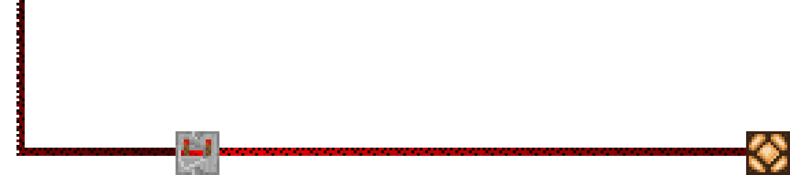

 
<b><code>> tech stack</code></b>  
<b>Systems & Low-Level</b> 
  
<b>Web & Fullstack</b> 
  
<b>Tools & Infra</b> 
  
<b><code>> game dev</code></b> 
Unity (C#) · Godot · Pygame · CSFML  
 

 
<b><code>> what I build</code></b>  
<code>◆ Fullstack web apps — React, Next.js, Node, Python</code> 
<code>◆ Games — Unity (C#), Godot, CSFML, Pygame</code> 
<code>◆ AI agent systems — orchestration, multi-agent frameworks</code> 
<code>◆ Systems programming — C, C++, Haskell, performance-critical code</code>

 
<b><code>> stats</code></b>  

 
<i><code>the best code is the one that ships.</code></i>

