<div align="center">

<!-- HEADER -->


</div>

<!-- ═══════════════════ ROW 1 → ═══════════════════ -->
<p align="center">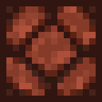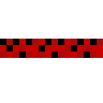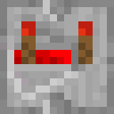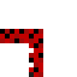</p>

<!-- connector right -->
<p align="right">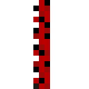&nbsp;&nbsp;&nbsp;&nbsp;&nbsp;&nbsp;&nbsp;&nbsp;&nbsp;&nbsp;&nbsp;&nbsp;</p>

<div align="center">

<a href="https://github.com/kepalas02">
  
</a>

</div>

<!-- connector right -->
<p align="right">&nbsp;&nbsp;&nbsp;&nbsp;&nbsp;&nbsp;&nbsp;&nbsp;&nbsp;&nbsp;&nbsp;&nbsp;</p>

<!-- ═══════════════════ ROW 2 ← ═══════════════════ -->
<p align="center">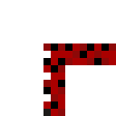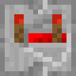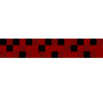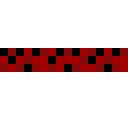</p>

<!-- connector left -->
<p align="left">&nbsp;&nbsp;&nbsp;&nbsp;&nbsp;&nbsp;&nbsp;&nbsp;&nbsp;&nbsp;&nbsp;&nbsp;</p>

<div align="center">

### `> tech stack`

**Systems & Low-Level**


**Web & Fullstack**


**Tools & Infra**


</div>

<!-- connector left -->
<p align="left">&nbsp;&nbsp;&nbsp;&nbsp;&nbsp;&nbsp;&nbsp;&nbsp;&nbsp;&nbsp;&nbsp;&nbsp;</p>

<!-- ═══════════════════ ROW 3 → (game dev wire) ═══════════════════ -->

<div align="center">

### `> game dev`

<a href="https://unity.com"></a><a href="https://godotengine.org"></a><a href="https://www.pygame.org"></a><a href="https://www.sfml-dev.org/download/csfml"></a>

<sub>Unity (C#) · Godot · Pygame · CSFML</sub>

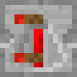

</div>

<p align="center">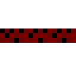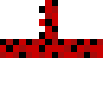</p>

<!-- connector right -->
<p align="right">&nbsp;&nbsp;&nbsp;&nbsp;&nbsp;&nbsp;&nbsp;&nbsp;&nbsp;&nbsp;&nbsp;&nbsp;</p>

<div align="center">

### `> what I build`

```
 ◆ Fullstack web apps          — React, Next.js, Node, Python
 ◆ Games                       — Unity (C#), Godot, CSFML, Pygame
 ◆ AI agent systems            — orchestration, multi-agent frameworks
 ◆ Systems programming         — C, C++, Haskell, performance-critical code
```

</div>

<!-- connector right -->
<p align="right">&nbsp;&nbsp;&nbsp;&nbsp;&nbsp;&nbsp;&nbsp;&nbsp;&nbsp;&nbsp;&nbsp;&nbsp;</p>

<!-- ═══════════════════ ROW 4 ← ═══════════════════ -->
<p align="center">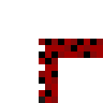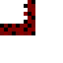</p>

<!-- connector left -->
<p align="left">&nbsp;&nbsp;&nbsp;&nbsp;&nbsp;&nbsp;&nbsp;&nbsp;&nbsp;&nbsp;&nbsp;&nbsp;</p>

<div align="center">

### `> stats`


</div>

<!-- connector left -->
<p align="left">&nbsp;&nbsp;&nbsp;&nbsp;&nbsp;&nbsp;&nbsp;&nbsp;&nbsp;&nbsp;&nbsp;&nbsp;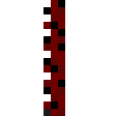</p>

<!-- ═══════════════════ ROW 5 → ═══════════════════ -->
<p align="center">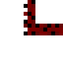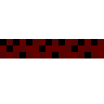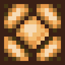</p>

<br/>

<div align="center">


<br/><br/>

*`the best code is the one that ships.`*

</div>

<!-- FOOTER -->

