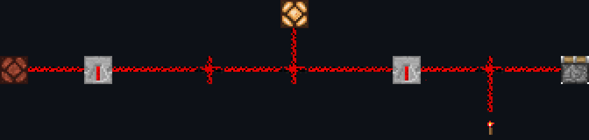
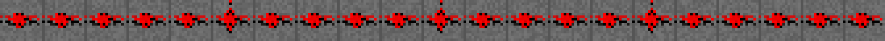
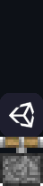
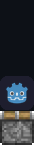
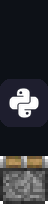
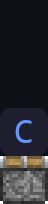

<div align="center">

<!-- ANIMATED HEADER -->


<!-- REDSTONE CIRCUIT — animated with particles -->


<!-- TYPING ANIMATION -->
<a href="https://github.com/kepalas02">
  
</a>

</div>

<!-- REDSTONE SEPARATOR -->
<div align="center"></div>

### `> tech stack`

<div align="center">

**Systems & Low-Level**


**Web & Fullstack**


**Game Development**

<a href="https://unity.com"></a>&nbsp;&nbsp;
<a href="https://godotengine.org"></a>&nbsp;&nbsp;
<a href="https://www.pygame.org"></a>&nbsp;&nbsp;
<a href="https://www.sfml-dev.org/download/csfml"></a>

<sub>Unity (C#) · Godot · Pygame · CSFML</sub>

**Tools & Infra**


</div>

<!-- REDSTONE SEPARATOR -->
<div align="center"></div>

### `> what I build`

```
 ◆ Fullstack web apps          — React, Next.js, Node, Python
 ◆ Games                       — Unity (C#), Godot, game design
 ◆ Bots & automation           — Discord bots, trading systems
 ◆ Security                    — Pentesting, reverse engineering
 ◆ Developer tooling           — CLI tools, agent systems
```

<!-- REDSTONE SEPARATOR -->
<div align="center"></div>

### `> stats`

<div align="center">


</div>

<!-- REDSTONE SEPARATOR -->
<div align="center"></div>

<div align="center">


<br/><br/>

```
⬛🟥⬛⬛⬛⬛⬛⬛⬛⬛⬛⬛⬛⬛⬛⬛⬛⬛⬛🟥⬛
⬛⬛🟥🟥🟥⬛⬛⬛⬛⬛⬛⬛⬛⬛⬛🟥🟥🟥⬛⬛⬛
⬛⬛⬛⬛⬛🟥🟥🟥🟥🟥🟥🟥🟥🟥🟥⬛⬛⬛⬛⬛⬛
```

*`the best code is the one that ships.`*

</div>

<!-- ANIMATED FOOTER -->

